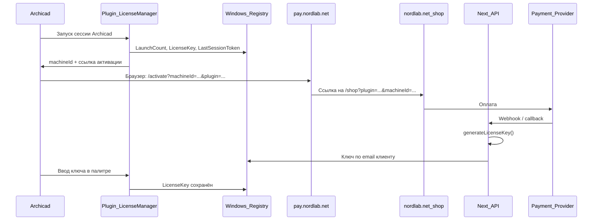

# Nordlab — сводка: сайт, сервер, плагины

Документ фиксирует текущее состояние инфраструктуры: где лежит код, как подключаться к серверу, что уже сделано и как плагины Archicad связаны с сайтом.

**Дата среза:** 9 июля 2026

---

## 1. Карта папок

### Сайт (Next.js)

| Что | Путь |
|-----|------|
| Репозиторий (локально) | `D:\nordlab` |
| GitHub | `https://github.com/DGersmv/nordlab_archicad_web` |
| Код на VPS | `/var/www/nordlab` |

**Структура проекта:**

```
D:\nordlab\
├── app/                    # Страницы и API (Next.js App Router)
│   ├── [locale]/           # /ru/..., /en/... (через middleware)
│   │   ├── activate/       # Точка входа из плагинов (pay.nordlab.net)
│   │   ├── shop/           # Магазин + оплата
│   │   ├── download/       # Ссылки на .apx
│   │   └── payment/        # success / fail после оплаты
│   └── api/
│       ├── contact/        # Форма обратной связи
│       ├── plugin-order/   # Ручная заявка (без автоплатежа)
│       ├── admin/generate-license/
│       └── payment/robokassa/   # init + result webhook
├── components/             # UI (RobokassaPayForm, формы и т.д.)
├── content/                # Тексты, цены, downloads, legal
├── lib/                    # license, orders, robokassa, payment-email
├── messages/               # i18n (ru / en)
├── public/downloads/       # .apx для скачивания с сайта
│   ├── ac27/
│   ├── ac28/
│   └── ac29/
├── data/                   # orders.json (на сервере, не в git)
├── deploy/                 # VPS, DNS, nginx, update.sh
├── scripts/                # generate-license.mjs (CLI)
├── middleware.ts           # Локали + pay.nordlab.net → /activate
└── .env                    # Секреты (SMTP, Robokassa, LICENSE_ADMIN_SECRET)
```

### Плагины Archicad (локальная сборка)

Сборки для **AC27 / AC28 / AC29**. Исходники — в папках Graphisoft API Development Kit:

| Плагин | AC27 | AC28 | AC29 |
|--------|------|------|------|
| **OpeningMaster** | `C:\Program Files\Graphisoft\API Development Kit 27.6003\Examples\OpeningMaster` | `...\API Development Kit 28.4001\Examples\OpeningMaster` | `...\API.Development.Kit.WIN.29.3100\Examples\OpeningMaster` |
| **TableSet** | `...\27.6003\Examples\TableSet` | `...\28.4001\Examples\TableSet` | `...\29.3100\Examples\TableSet` |
| **MeshMaster** | `...\27.6003\Examples\DWG-mesh` | `...\28.4001\Examples\MeshMaster` | `...\29.3100\Examples\MeshMaster` |

**Результат сборки (Release):**

```
<проект>\ToArchicad\Release\
  OpeningMaster_AC27.apx
  TableSet_AC27.apx
  MeshMaster_AC27.apx
  … (аналогично AC28, AC29)
```

**CMake build-папки (примеры):**

- OpeningMaster AC27: `...\OpeningMaster\build_cursor\`
- OpeningMaster AC28/29: `...\OpeningMaster\build_release\`

Подробная инструкция по сборке всех версий и выгрузке на сервер — в [разделе 9](#9-сборка-плагинов-ac272829-и-публикация-на-сервер).

## 2. Сервер и доступ

### VPS (Россия)

| Параметр | Значение |
|----------|----------|
| IP | `213.171.29.225` |
| SSH-пользователь | `admin` |
| Путь приложения | `/var/www/nordlab` |
| Процесс | PM2, имя `nordlab` |
| Порт приложения | `3001` (см. `deploy/update.sh`) |
| Reverse proxy | nginx → `127.0.0.1:3001` |

### Подключение по SSH

```bash
ssh admin@213.171.29.225
cd /var/www/nordlab
```

### Обновление сайта после изменений в Git

```bash
ssh admin@213.171.29.225
cd /var/www/nordlab
bash deploy/update.sh
```

Скрипт `deploy/update.sh` выполняет: `git pull` → `npm ci` → `npm run build` → `pm2 restart nordlab`.

Альтернатива (ручная):

```bash
cd /var/www/nordlab
git pull origin main
npm ci
npm run build
pm2 restart nordlab
```

### Загрузка .apx на сервер (без git)

Файлы отдаются статически из `public/downloads/`:

```powershell
scp "C:\Program Files\Graphisoft\API Development Kit 27.6003\Examples\OpeningMaster\ToArchicad\Release\OpeningMaster_AC27.apx" `
    admin@213.171.29.225:/var/www/nordlab/public/downloads/ac27/OpeningMaster_AC27.apx
```

Аналогично для `ac28/`, `ac29/` и остальных плагинов.

Перезапуск PM2 после загрузки `.apx` **не нужен**.

### Проверка на сервере

```bash
# Статус приложения
pm2 status nordlab
pm2 logs nordlab --lines 50

# Локальный ответ
curl -s -o /dev/null -w "%{http_code}" http://127.0.0.1:3001/

# Файлы загрузок
ls -la /var/www/nordlab/public/downloads/ac27/
```

### Домены и DNS

| Домен | Назначение |
|-------|------------|
| `nordlab.net` | Основной сайт |
| `www.nordlab.net` | То же приложение |
| `pay.nordlab.net` | Редирект на `/activate` (см. `middleware.ts`) |

DNS: A-записи `@`, `www`, `pay` → `213.171.29.225` (OpenSRS). Подробности: [DNS-OPENSRS.md](./DNS-OPENSRS.md).

SSL:

```bash
sudo certbot --nginx -d nordlab.net -d www.nordlab.net -d pay.nordlab.net
```

Конфиг nginx: [deploy/nginx/nordlab.conf](./nginx/nordlab.conf).

> **Важно:** если NS ещё указывают на Vercel, часть трафика может идти на старый хостинг. После переноса DNS удалите домены из Vercel Dashboard.

### Почта

- Ящик: `admin@nordlab.net` (Zoho)
- SMTP в `.env`: `SMTP_HOST=smtp.zoho.com`, порт `465`
- Используется для: контактная форма, выдача лицензий после оплаты, ручные заявки

---

## 3. Связь плагинов и сайта



### URL из плагинов

Все три плагина открывают одну точку входа:

```
https://pay.nordlab.net/activate?machineId=<ID>&plugin=<slug>
```

| Плагин | `plugin=` | Machine ID (пример) |
|--------|-----------|---------------------|
| OpeningMaster | `openingmaster` | `OM1-XXXX-XXXX-XXXX` |
| TableSet | `tableset` | `TS1-XXXX-XXXX-XXXX` |
| MeshMaster | `meshmaster` | `MM1-XXXX-XXXX-XXXX` |

Код в плагинах: `Src/LicenseManager.cpp` → `BuildLicenseUrl()`.

### Реестр Windows (trial + активация)

`HKEY_CURRENT_USER\Software\Nordlab\`:

| Плагин | Ключ реестра | Значения |
|--------|--------------|----------|
| OpeningMaster | `OpeningMaster` | `LaunchCount`, `LicenseKey`, `LastSessionToken` |
| TableSet | `TableSet` | то же (+ demo-файл для TableSet) |
| MeshMaster | `MeshDwgMaster` | то же |

- **10 бесплатных запусков** Archicad на плагин (не на сессию браузера).
- `LastSessionToken` — защита от повторного +1 при переустановке `.apx` в той же сессии Archicad.
- Machine ID считается на лету (не хранится в реестре).
- Ключ проверяется **офлайн** в плагине (FNV-1a, те же соли, что на сайте).

### Форматы лицензионных ключей

Генерация на сайте: `lib/license.ts` (должна совпадать с `LicenseManager.cpp` в плагинах).

| Плагин | Формат ключа | Salt (пример) |
|--------|--------------|---------------|
| OpeningMaster | `OM27-XXXXXXXX-XXXXXXXX` | `OpeningMaster\|AC27\|Nordlab\|2026` |
| TableSet | `TS27-XXXXXXXX-XXXXXXXX` | `TableSet\|AC27\|Nordlab\|2026` |
| MeshMaster | `MM27-XXXXXXXX-XXXXXXXX` | `MeshDwgMaster\|AC27\|Nordlab\|2026` |

Цена: **3000 ₽** за плагин (`lib/license.ts` → `LICENSE_PRICES`).

### CLI генерация ключа (локально)

```bash
cd D:\nordlab
npm run license:generate -- openingmaster OM1-E0C6-7737-78EA
npm run license:generate -- tableset TS1-....
npm run license:generate -- meshmaster MM1-....
```

### Удалённая генерация (API)

```http
POST /api/admin/generate-license
Authorization: Bearer <LICENSE_ADMIN_SECRET>

{ "pluginSlug": "openingmaster", "machineId": "OM1-..." }
```

---

## 4. Сайт: что сделано

### Страницы

| URL | Описание |
|-----|----------|
| `/` / `/ru` | Главная, каталог плагинов |
| `/shop` | Покупка: Robokassa (если настроен) + ручная форма |
| `/activate` | Вход из плагина (machineId, ссылка в магазин) |
| `/download` | Скачивание trial `.apx` |
| `/plugins/[slug]` | Страница плагина |
| `/offer`, `/privacy`, `/terms`, `/refund` | Юридические страницы (ООО «227.ИНФО») |
| `/payment/success`, `/payment/fail` | После оплаты |
| `/custom` | Кастомные заказы |

### API

| Маршрут | Назначение |
|---------|------------|
| `POST /api/contact` | Обратная связь → email (+ Telegram опционально) |
| `POST /api/plugin-order` | Ручная заявка без автоплатежа |
| `POST /api/payment/robokassa/init` | Создание заказа, redirect URL |
| `GET/POST /api/payment/robokassa/result` | Webhook Robokassa → ключ + email |
| `POST /api/admin/generate-license` | Ручная/удалённая выдача ключа |

### Заказы

Файл на сервере: `/var/www/nordlab/data/orders.json` (не в git).

Поля: `invId`, `pluginSlug`, `machineId`, `email`, `amount`, `status`, `licenseKey`, `isTest`, даты.

### Локализация

- Языки: `ru`, `en`
- Cookie `NEXT_LOCALE` для сохранения русского при навигации
- `pay.nordlab.net/ru` → `/ru/activate`

### Загрузки плагинов

Конфиг: `content/downloads.ts`

| Файл на сайте | Archicad |
|---------------|----------|
| `public/downloads/ac27/OpeningMaster_AC27.apx` | 27 |
| `public/downloads/ac28/OpeningMaster_AC28.apx` | 28 |
| `public/downloads/ac29/OpeningMaster_AC29.apx` | 29 |

То же для `TableSet_AC*.apx`, `MeshMaster_AC*.apx`.

Публичный URL: `https://nordlab.net/downloads/ac27/OpeningMaster_AC27.apx`

### Оплата

| Провайдер | Статус в коде |
|-----------|---------------|
| **Robokassa** | Реализовано (`lib/robokassa.ts`, форма на `/shop`) |
| **CloudPayments** | Ключи есть локально (`cloudpayments.txt`), **интеграция в коде ещё не сделана** |
| **Ручная оплата** | Форма `/shop` → `/api/plugin-order` |

Переменные Robokassa: см. `.env.example` (`ROBOKASSA_*`).

> **Безопасность:** не коммитьте `cloudpayments.txt` и `.env` в git. Ключи CloudPayments перенести в `.env` на сервере после интеграции.

### Юридическое лицо

`content/company.ts` — ООО «227.ИНФО», ИНН, ОГРН, адрес, `paymentProvider: 'Robokassa'` (обновить при переходе на CloudPayments).

---

## 5. Плагины: что сделано

| Функция | OpeningMaster | TableSet | MeshMaster |
|---------|---------------|----------|------------|
| Trial 10 запусков | да | да | да |
| Machine ID | OM1-… | TS1-… | MM1-… |
| Ссылка на pay.nordlab.net | да | да | да |
| Офлайн-проверка ключа | да | да | да |
| LastSessionToken (фикс переустановки) | да | да | да |
| Сборки AC27/28/29 | да | да | да |

### Известные доработки в плагинах (не на сайте)

- **TableSet:** fallback имени класса элемента в колонке (если нет классификации — Стена/Окно и т.д.)
- **OpeningMaster:** фикс счётчика при переустановке `.apx` без перезапуска Archicad

---

## 6. Переменные окружения (.env на сервере)

| Группа | Переменные |
|--------|------------|
| SMTP | `SMTP_HOST`, `SMTP_PORT`, `SMTP_USER`, `SMTP_PASS`, `SMTP_TO` |
| Telegram | `TELEGRAM_BOT_TOKEN`, `TELEGRAM_CHAT_ID` |
| Лицензии | `LICENSE_ADMIN_SECRET` |
| Капча | `TURNSTILE_SECRET_KEY`, `NEXT_PUBLIC_TURNSTILE_SITE_KEY` |
| Robokassa | `ROBOKASSA_MERCHANT_LOGIN`, `ROBOKASSA_PASSWORD_1/2`, тестовые пароли, `ROBOKASSA_FORCE_TEST` |
| CloudPayments (план) | `CLOUDPAYMENTS_PUBLIC_ID`, `CLOUDPAYMENTS_API_SECRET` |

Редактирование на сервере:

```bash
ssh admin@213.171.29.225
nano /var/www/nordlab/.env
pm2 restart nordlab
```

---

## 7. Что в планах

1. **Интеграция CloudPayments** (виджет или API + webhook Pay/Fail) вместо или рядом с Robokassa — ключи уже получены.
2. Обновить legal/company (`paymentProvider`, оферта) под CloudPayments.
3. Убедиться, что DNS полностью на VPS (без Vercel).
4. Добавить `cloudpayments.txt` в `.gitignore`, секреты только в `.env`.
5. Синхронизировать `README.md` с текущим состоянием (там ещё «manual sale only»).

---

## 8. Полезные ссылки

| Ресурс | URL |
|--------|-----|
| Сайт | https://nordlab.net |
| Активация из плагина | https://pay.nordlab.net |
| GitHub | https://github.com/DGersmv/nordlab_archicad_web |
| CloudPayments — формы оплаты | https://cloudpayments.ru/help/payments/bills |
| CloudPayments — разработчикам | https://developers.cloudpayments.ru/ |
| Деплой VPS | [VPS-SETUP.md](./VPS-SETUP.md) |
| DNS OpenSRS | [DNS-OPENSRS.md](./DNS-OPENSRS.md) |

---

## 9. Сборка плагинов AC27–AC29 и публикация на сервер

### Что нужно на машине сборки

| Компонент | Версия / примечание |
|-----------|---------------------|
| Windows | 10/11 x64 |
| Visual Studio | 2022 с workload **Desktop development with C++** |
| CMake | 3.16+ (в PATH) |
| Python | 3.x (для `CompileResources.py` из DevKit) |
| API DevKit | Отдельный kit на каждую версию Archicad (см. таблицу ниже) |

**Установленные DevKit (текущие пути):**

| Archicad | Папка API Development Kit |
|----------|----------------------------|
| **27** | `C:\Program Files\Graphisoft\API Development Kit 27.6003` |
| **28** | `C:\Program Files\Graphisoft\API Development Kit 28.4001` |
| **29** | `C:\Program Files\Graphisoft\API.Development.Kit.WIN.29.3100` |

Каждый плагин собирается **внутри своего DevKit** — нельзя собрать AC28-бинарник из AC27 kit.

### Имена выходных файлов

Всегда **Release**, всегда суффикс версии Archicad:

| Плагин | AC27 | AC28 | AC29 |
|--------|------|------|------|
| OpeningMaster | `OpeningMaster_AC27.apx` | `OpeningMaster_AC28.apx` | `OpeningMaster_AC29.apx` |
| TableSet | `TableSet_AC27.apx` | `TableSet_AC28.apx` | `TableSet_AC29.apx` |
| MeshMaster | `MeshMaster_AC27.apx` | `MeshMaster_AC28.apx` | `MeshMaster_AC29.apx` |

Локальный путь после сборки:

```
<проект>\ToArchicad\Release\<ИмяФайла>.apx
```

### Первая настройка CMake (один раз на проект)

Откройте **Developer PowerShell for VS 2022** или обычный PowerShell (если `cmake` и MSBuild в PATH).

Шаблон для любого плагина:

```powershell
$Project = "C:\Program Files\Graphisoft\API Development Kit 27.6003\Examples\OpeningMaster"
$BuildDir = Join-Path $Project "build_release"   # или build_cursor — любое имя

New-Item -ItemType Directory -Force -Path $BuildDir | Out-Null
Set-Location $BuildDir
cmake -G "Visual Studio 17 2022" -A x64 $Project
```

CMake сам находит DevKit (`AC_API_DEVKIT_DIR` = `../../` от папки Examples).

**Рекомендуемые build-папки (уже используются):**

| Плагин | AC27 | AC28 | AC29 |
|--------|------|------|------|
| OpeningMaster | `build_cursor` | `build_release` | `build_release` |
| TableSet | `build_release_cursor` | `build_release` | `build_release` |
| MeshMaster | `build_cursor_ui` | `build_release` | `build_release` |

> AC27 MeshMaster: папка проекта называется `DWG-mesh`, но выходной файл — `MeshMaster_AC27.apx`.

### Сборка Release

```powershell
Set-Location "<проект>\<build-папка>"
cmake --build . --config Release
```

Проверка:

```powershell
Get-Item "<проект>\ToArchicad\Release\*.apx" | Select-Object Name, Length, LastWriteTime
```

### Полный цикл: все 9 файлов (PowerShell)

Скопируйте блок, при необходимости поправьте пути к DevKit.

```powershell
function Build-Plugin {
    param([string]$ProjectDir, [string]$BuildDirName = "build_release")
    $build = Join-Path $ProjectDir $BuildDirName
    if (-not (Test-Path (Join-Path $build "CMakeCache.txt"))) {
        New-Item -ItemType Directory -Force -Path $build | Out-Null
        Push-Location $build
        cmake -G "Visual Studio 17 2022" -A x64 $ProjectDir
        Pop-Location
    }
    Push-Location $build
    cmake --build . --config Release
    Pop-Location
    Get-ChildItem (Join-Path $ProjectDir "ToArchicad\Release\*.apx")
}

$K27 = "C:\Program Files\Graphisoft\API Development Kit 27.6003\Examples"
$K28 = "C:\Program Files\Graphisoft\API Development Kit 28.4001\Examples"
$K29 = "C:\Program Files\Graphisoft\API.Development.Kit.WIN.29.3100\Examples"

# OpeningMaster
Build-Plugin "$K27\OpeningMaster" "build_cursor"
Build-Plugin "$K28\OpeningMaster" "build_release"
Build-Plugin "$K29\OpeningMaster" "build_release"

# TableSet
Build-Plugin "$K27\TableSet" "build_release_cursor"
Build-Plugin "$K28\TableSet" "build_release"
Build-Plugin "$K29\TableSet" "build_release"

# MeshMaster
Build-Plugin "$K27\DWG-mesh" "build_cursor_ui"
Build-Plugin "$K28\MeshMaster" "build_release"
Build-Plugin "$K29\MeshMaster" "build_release"
```

### Куда выгружать на сервер

Все `.apx` лежат на VPS в `public/downloads/` — **имя файла на сервере должно совпадать** с `content/downloads.ts`.

| Локальный файл (после сборки) | Путь на сервере | Публичный URL |
|--------------------------------|-----------------|---------------|
| `...\OpeningMaster\ToArchicad\Release\OpeningMaster_AC27.apx` | `/var/www/nordlab/public/downloads/ac27/OpeningMaster_AC27.apx` | `https://nordlab.net/downloads/ac27/OpeningMaster_AC27.apx` |
| `...\OpeningMaster\ToArchicad\Release\OpeningMaster_AC28.apx` | `.../ac28/OpeningMaster_AC28.apx` | `.../downloads/ac28/OpeningMaster_AC28.apx` |
| `...\OpeningMaster\ToArchicad\Release\OpeningMaster_AC29.apx` | `.../ac29/OpeningMaster_AC29.apx` | `.../downloads/ac29/OpeningMaster_AC29.apx` |
| `...\TableSet\ToArchicad\Release\TableSet_AC27.apx` | `.../ac27/TableSet_AC27.apx` | `.../downloads/ac27/TableSet_AC27.apx` |
| `...\TableSet\ToArchicad\Release\TableSet_AC28.apx` | `.../ac28/TableSet_AC28.apx` | `.../downloads/ac28/TableSet_AC28.apx` |
| `...\TableSet\ToArchicad\Release\TableSet_AC29.apx` | `.../ac29/TableSet_AC29.apx` | `.../downloads/ac29/TableSet_AC29.apx` |
| `...\DWG-mesh\ToArchicad\Release\MeshMaster_AC27.apx` | `.../ac27/MeshMaster_AC27.apx` | `.../downloads/ac27/MeshMaster_AC27.apx` |
| `...\MeshMaster\ToArchicad\Release\MeshMaster_AC28.apx` | `.../ac28/MeshMaster_AC28.apx` | `.../downloads/ac28/MeshMaster_AC28.apx` |
| `...\MeshMaster\ToArchicad\Release\MeshMaster_AC29.apx` | `.../ac29/MeshMaster_AC29.apx` | `.../downloads/ac29/MeshMaster_AC29.apx` |

### Загрузка на сервер (scp)

Один файл:

```powershell
scp "C:\Program Files\Graphisoft\API Development Kit 27.6003\Examples\OpeningMaster\ToArchicad\Release\OpeningMaster_AC27.apx" `
    admin@213.171.29.225:/var/www/nordlab/public/downloads/ac27/OpeningMaster_AC27.apx
```

Все 9 файлов (после успешной сборки):

```powershell
$Server = "admin@213.171.29.225:/var/www/nordlab/public/downloads"
$K27 = "C:\Program Files\Graphisoft\API Development Kit 27.6003\Examples"
$K28 = "C:\Program Files\Graphisoft\API Development Kit 28.4001\Examples"
$K29 = "C:\Program Files\Graphisoft\API.Development.Kit.WIN.29.3100\Examples"

scp "$K27\OpeningMaster\ToArchicad\Release\OpeningMaster_AC27.apx" "$Server/ac27/"
scp "$K28\OpeningMaster\ToArchicad\Release\OpeningMaster_AC28.apx" "$Server/ac28/"
scp "$K29\OpeningMaster\ToArchicad\Release\OpeningMaster_AC29.apx" "$Server/ac29/"

scp "$K27\TableSet\ToArchicad\Release\TableSet_AC27.apx" "$Server/ac27/"
scp "$K28\TableSet\ToArchicad\Release\TableSet_AC28.apx" "$Server/ac28/"
scp "$K29\TableSet\ToArchicad\Release\TableSet_AC29.apx" "$Server/ac29/"

scp "$K27\DWG-mesh\ToArchicad\Release\MeshMaster_AC27.apx" "$Server/ac27/"
scp "$K28\MeshMaster\ToArchicad\Release\MeshMaster_AC28.apx" "$Server/ac28/"
scp "$K29\MeshMaster\ToArchicad\Release\MeshMaster_AC29.apx" "$Server/ac29/"
```

Проверка на сервере:

```bash
ssh admin@213.171.29.225 "ls -la /var/www/nordlab/public/downloads/ac{27,28,29}/*.apx"
```

Проверка скачивания (через VPS, если DNS ещё на Vercel):

```bash
curl -skI -H "Host: www.nordlab.net" "https://213.171.29.225/downloads/ac27/OpeningMaster_AC27.apx"
```

Ожидается `HTTP/1.1 200` и `Content-Length` равный размеру локального файла.

### Рекомендуемый порядок релиза

1. Собрать **Release** для нужной версии Archicad.
2. Локально проверить `.apx` в Add-On Manager (установка, trial, активация).
3. Загрузить `.apx` на сервер через `scp`.
4. Проверить URL скачивания и размер файла.
5. При изменении логики лицензий — убедиться, что соли в `LicenseManager.cpp` совпадают с `D:\nordlab\lib\license.ts`.

**PM2 / `npm run build` после загрузки `.apx` не нужны** — статика из `public/`.

### Частые проблемы

| Симптом | Решение |
|---------|---------|
| `cmake` не найден | Установить CMake, добавить в PATH, или использовать VS Developer PowerShell |
| Ошибка `CompileResources.py` | Установить Python 3, проверить что DevKit не повреждён |
| `/WX` — warning as error | Исправить предупреждение в коде или собирать тот же коммит, что уже собирался |
| Файл `.apx` не появился | Смотреть `ToArchicad\Release\`, не `build_*\Release\` |
| На сайте старый размер файла | DNS ещё на Vercel — проверять через IP + Host header или дождаться DNS |
| Счётчик trial сбрасывается при переустановке | Нужна сборка с `LastSessionToken` в `LicenseManager.cpp` |

### Установка в Archicad (для теста)

1. Archicad → **Add-On Manager** → **Install** → выбрать `.apx`.
2. Или скопировать в папку add-ons пользователя Graphisoft.
3. Перезапуск Archicad — только если Add-On Manager просит; для проверки переустановки — **не перезапускать** Archicad.

---

## 10. Быстрая шпаргалка

```bash
# SSH
ssh admin@213.171.29.225

# Деплой сайта
cd /var/www/nordlab && bash deploy/update.sh

# Логи
pm2 logs nordlab

# Ключ вручную (локально)
cd D:\nordlab && npm run license:generate -- openingmaster OM1-XXXX-XXXX-XXXX

# Сборка одного плагина (Release)
Set-Location "C:\Program Files\Graphisoft\API Development Kit 27.6003\Examples\OpeningMaster\build_cursor"
cmake --build . --config Release

# Залить все 9 apx (см. раздел 9)
# scp ... admin@213.171.29.225:/var/www/nordlab/public/downloads/ac27/
```
